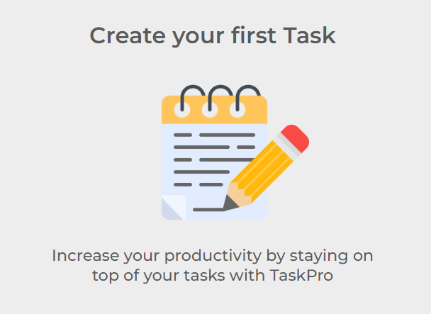

<!-- PROJECT LOGO -->
 

  
  <h3 align="center">TaskPro Productivity App</h3>
  <a href="https://final-project-ironhack-neon.vercel.app/">Visit Website</a>

<!-- TABLE OF CONTENTS -->

  
Table of Contents

  <ol>
    <li>
      <a href="#acerca-del-proyecto">Acerca del Proyecto</a>
      <ul>
        <li><a href="#construido-con">Construido Con</a></li>
      </ul>
    </li>
    <li>
    <a href="#roadmap">Roadmap</a>
     <ul>
     <li><a href="#backlog">Back log</a></li>
        <li><a href="#day-one">Lunes 23, Enero 2023</a></li>
        <li><a href="#day-two">Martes 24, Enero 2023</a></li>
        <li><a href="#day-three">Miercoles 25, Enero 2023</a></li>
        <li><a href="#day-four">Jueves 26, Enero 2023</a></li>
        <li><a href="#day-five">Viernes 27, Enero 2023</a></li>
      </ul>
    </li>
    <li><a href="#acerca">Acerca</a></li>
    <li><a href="#agradecimientos">Agradecimientos</a></li>
    <li><a href="#desafío-técnico">Desafío Técnico</a></li>
    <li><a href="#grande-error">Grande Error</a></li>
  </ol>

<!-- ABOUT THE PROJECT -->

## Acerca del Proyecto

 <h2>TaskPro</h2>

Este proyecto fue desarrollado como final proyect para un bootcamp de front end de la escuela Ironhack. El objectivo era desarrollar una single page web application capaz de registrar usuarios y ofrecer la funcionabilidad de crear y guardar notas. El objectivo era poner en práctica conocimientos de Vue.js.

Tecnologías utilizadas:

- VUE
- VUE Router
- Pinia
- HTML
- CSS
- Supabase
- JavaScript
- VsCode
- Google Chrome DevTools
- GitHub
- Vercel

El proyecto de una single paga web application con que desde el home page expone las tareas guardadas por el usuario. La información del usuario y de las tareas es registrada en Supabase.

Desarrollado por Alvaro Fernandez.

(<a href="#readme-top">back to top</a>)

### Construido Con

Este proyecto fue desarrollado con:

- HTML
- CSS
- Vue.js

Esta web application esta construida con el framework de JavaScript Vue.js en su version mas reciente Vue 3, junto con Vue Router y la biblioteca de Stores Pinia.

(<a href="#readme-top">back to top</a>)

## Roadmap

#### Backlog

<!-- - [ ] Ej - Tarea a completar y mover a su respectivo dia de ejecucion

#### Day One -->

#### Day One

###### Martes 7, Febrero 2023

- [x] Local and online repos ready
- [x] Database connected
- [x] Functioning Sing Up & Sign In
- [x] Functioning Task CRUD
- [x] Start styling login pages
- [x] Start Navbar & Footer

#### Day Two

###### Miercoles 8, Febrero 2023

- [x] Working edit task
- [x] Working task completed button
- [x] Style home page & tasks
- [x] Change task button for icons

#### Day Three

###### Jueves 9, Febrero 2023

- [x] Style home page & tasks
- [x] Add functionality to icon buttons
- [x] Show task content when you click on title
- [x] Change form input styles
- [x] Refactor CSS & create CSS vars
- [x] Start delete warning modal

#### Day Four

###### Viernes 10, Febrero 2023

- [ ] Fix nav bar
- [ ] Create dropdown menu for nav
- [x] Fix issue with task descriptions
- [x] Arrow for task description
- [x] Fix footer
- [x] Shorten up long titles
- [ ] Scroll up arrow
- [x] Fix text crop in input span animation

#### Day Five

###### Sunday 12, Febrero 2023

- [ ] Fix nav bar
- [x] Create dropdown menu for nav

#### Day Six

###### Monday 13, Febrero 2023

- [x] Logic for short title only when needed
- [x] Profile Page
- [ ] Fix nav bar
- [x] Fix text align of task description
- [x] Change favicon

#### Day Seven

###### Tuesday 14, Febrero 2023

- [x] Scrolling blocked when modal is active
- [x] Finish styling modal
- [x] Make dropdown menu its own component
- [x] Start dealine feature
- [x] Fix nav bar

#### Day Eight

###### Wednesday 15, Febrero 2023

- [x] Create scroll up feature
- [x] Add functionality to scroll up feature
- [ ] Change action buttons img for icons
- [x] Finish Profile Page functionality
- [x] Modify widths on media query of new task and task item

#### Day Nine

###### Thursday 16, Febrero 2023

- [x] Account details updated when edit is submitted
- [x] Fixed with profile webpage

#### Day Ten

###### Sunday 19, Febrero 2023

- [x] Figure out why icons are not displaying
- [x] Change action buttons img for icons

#### Day Ten

###### Monday 20, Febrero 2023

- [x] Change Sign in & sign up sizing
- [x] Add show password icon and functionality to sign in
- [x] Show username on dropdown menu
- [x] Upload image to database

#### Day Eleven

###### Tuesday 21, Febrero 2023

- [x] Display avatar image in profile and dropdown menu
- [x] Change account avatar button distribution
- [x] Block action buttons when other is activated
- [x] Create component to change between task category
- [ ] Look into creating Complete Task category

#### Day Twelve

###### Wednesday 22, Febrero 2023

- [x] Create functioning Task categories
- [ ] Start deadline feature
- [x] Fix footer issues ?
- [x] Fix cursor on action icons
- [x] Add link to nav logo
- [x] Fix issues with avatar
- [x] Fix issue with tasks not refreashing

#### Day Thirteen

###### Thursday 23, Febrero 2023

- [x] By default pending
- [x] Make a task dissapear when its complete
- [ ] Modal for sign up
- [x] Total task & pending count in account
- [x] Welcome screen when no tasks
- [x] Re-do account edit layout
- [ ] Start deadline feature
- [x] Add animated inputs to sign up
- [x] Add show password to sign up

#### Day Fourteen

###### Thursday 23, Febrero 2023

- [x] Present proyect to class

(<a href="#readme-top">back to top</a>)

<!-- Acerca de mi -->

## Acerca

Alvaro Fernandez - [LinkedIn](https://www.linkedin.com/in/%C3%A1lvaro-fern%C3%A1ndez-%C3%A1lvarez-05243138/)

Project Link: [Repositorio de GitHub](https://github.com/iamalvaro/final-project-ironhack)

Presentation Link: [GoogleSlides](https://docs.google.com/presentation/d/1RiIAL31wpknrNFQryonuhTeVf7pmxtP6XHhytN96oZc/edit?usp=sharing)

Actualmente soy un estudiantes de desarrollo web Frontend en IronHack Barcelona. Antes de empezar este bootcamp habia estudiado a través de Udemy y freeCodeCamp desarrollo web durante medio año.

(<a href="#readme-top">back to top</a>)

<!-- ACKNOWLEDGMENTS -->

## agradecimientos

Me gustaria agradecer a IronHack la oportunidad de poder participar en este Bootcamp.

A nuestro profesor y project manager Diego Zito por su labor docente y motivacion diaria.

A los dos excelentes teacher assistants, Aleix y Jarko, por su paciencia y su manera única de provocarnos nuevas formas de ver el codigo y en entenderlo en mayor profundidad.

Por último me gustaría agradecer a mis compañeros el apoyo que me han ofrecido esta semana de trabajo. Tanto por compartir referencias o consejos técnicos, como por el apoyo anímico, siempre a través del humor

- [Icon Libraries](insert-link-here)
- [Google Font Libraries](insert-link-here)

(<a href="#readme-top">back to top</a>)

## Desafío Técnico

Los principales problemas tecnicos de este proyecto fueron:

- La comunicación entre los diferentes componentes que comprende la applicación a través de emits y props.

- La comunicación de estos mismos componentes con la base de datos a través de los Stores de Pinia.

- Utilizar metodos propios de Vue como computed y onMount para la manipulación del documento.

## Grande Error

El unico error que persiste en este proyecto es provocado por aplicar conceptos de vanilla JavaScript a Vue.

En particular DOM manipulation para mantener registro de un componente dentro del documento.

En un futuro intertare crear la misma función a través del metodo compunted y onUpdated.
